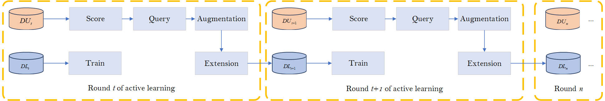
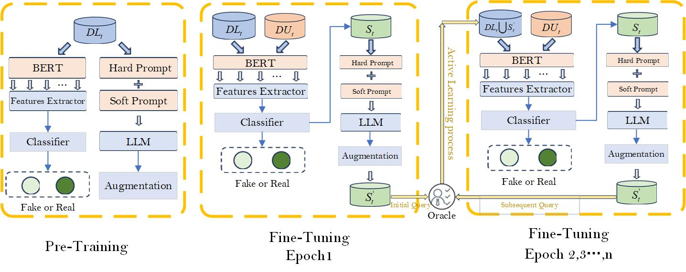
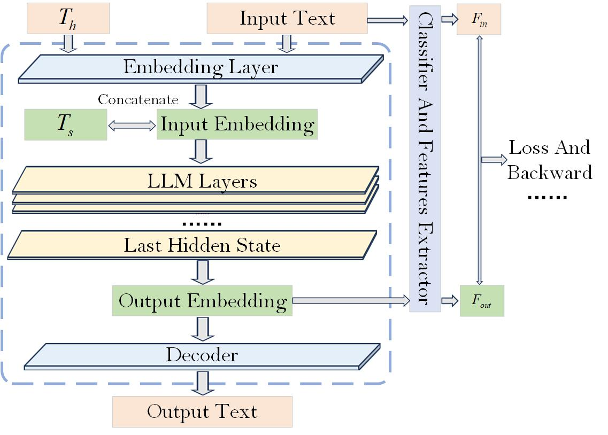

<div align="center">

# SharP

### Soft and Hard Prompt-Guided Augmentation with LLM for Low-Resource Fake News Detection

**Ziyu Luo · Wei Li · Haoping Huang · Kecheng Liu · Min Gao\***

Chongqing University · Chongqing University Central Hospital · University of Reading

[](https://www.python.org/)
[](https://pytorch.org/)
[](https://huggingface.co/docs/transformers/)
[](https://github.com/Fujizzz/SharP/actions/workflows/code-check.yml)
[](https://doi.org/10.1016/j.eswa.2026.131178)
[](docs/RUN_REVIEW.md)

*Official research code for the SharP article published in Expert Systems with Applications.*

</div>

## TL;DR

**SharP** is a boundary-aware augmentation framework for fake-news detection when labeled data are scarce. It combines a learnable **soft prompt** with a structured **hard prompt**, queries an LLM around uncertain classifier boundaries, and iteratively adds useful synthetic samples to the labeled set.

The retained workspace covers **PHEME**, **LIAR**, and **Twitter15/16**. Because the original code was adapted in place for each dataset, this repository preserves the identifiable dataset-specific versions and documents their reproduction boundaries explicitly.

## Publication

**Ziyu Luo, Wei Li, Haoping Huang, Kecheng Liu, and Min Gao.** “SharP: Soft and Hard Prompt-Guided Augmentation with LLM for Low Resource Fake News Detection.” *Expert Systems with Applications*, Volume 309, Article 131178, 2026. [https://doi.org/10.1016/j.eswa.2026.131178](https://doi.org/10.1016/j.eswa.2026.131178)

- **Available online:** 10 January 2026
- **Volume publication date:** 5 May 2026
- **Volume:** 309
- **Article number:** 131178
- **PII:** S0957417426000928

The repository copy at [`paper/SharP.pdf`](paper/SharP.pdf) is the author manuscript retained with the research artifact. Please use the DOI above to access and cite the publisher's Version of Record.

## Highlights

- **Dual-prompt generation:** hard prompts supply task instructions while soft prompts learn dataset-specific semantic patterns.
- **Boundary-aware querying:** entropy-based active selection focuses augmentation on samples near the detector's decision boundary.
- **Detector-guided prompt optimization:** classifier feedback and representation alignment guide soft-prompt learning.
- **Iterative low-resource learning:** selected and generated samples extend the labeled set over multiple active-learning rounds.
- **Three benchmark families:** preprocessing and experiment workflows for PHEME, LIAR, and Twitter15/16.

## Framework Overview



<p align="center"><em>
Figure 1. At round t, SharP scores the unlabeled pool, queries boundary samples, augments them with the prompt-guided LLM, and extends the labeled set for round t+1.
</em></p>

Given a labeled set $D_L^t$ and an unlabeled pool $D_U^t$, SharP alternates between detector training, uncertainty scoring, sample querying, LLM augmentation, and labeled-set extension:

```text
train detector on D_L^t
        ↓
score D_U^t and query high-entropy samples S_t
        ↓
optimize soft prompt with detector feedback
        ↓
combine soft prompt + hard prompt for LLM augmentation
        ↓
D_L^(t+1) = D_L^t ∪ S'_t
D_U^(t+1) = D_U^t \ S_t
```

## Model Architecture



<p align="center"><em>
Figure 2. SharP first pre-trains the detector and prompt module, then alternates boundary querying, prompt-guided augmentation, and detector fine-tuning.
</em></p>

The detector combines:

- a BERT text encoder;
- TextCNN branches for local semantic patterns;
- BiGRU branches over handcrafted affective features;
- a fake/real classifier;
- event-domain and marked/unmarked auxiliary heads.

The augmentation module freezes the causal LLM backbone and optimizes a 25-token soft prompt. During fine-tuning, selected pool samples are augmented and used to refine the detector boundary.

## Prompt-Guided Augmentation



<p align="center"><em>
Figure 3. The hard prompt T<sub>h</sub> and soft prompt T<sub>s</sub> are combined with the input embedding. Detector feedback aligns the generated representation with task-relevant features.
</em></p>

The augmentation path is implemented primarily in [`DAAL/amodel.py`](DAAL/amodel.py), while detector training, active selection, and iterative data extension are implemented in [`DAAL/model_adjust.py`](DAAL/model_adjust.py).

## Repository Layout

```text
SharP/
├── DAAL/                         # Core SharP model and training loop
│   ├── amodel.py                 # Soft/hard prompt LLM module
│   ├── model_adjust.py           # Detector + active augmentation loop
│   ├── process_data.py           # PHEME-oriented tensor conversion
│   └── run_sweep.py              # Low-resource label-budget sweep
├── idea1_features/               # Affective/linguistic feature code
├── experiments/
│   ├── pheme/                    # Retained PHEME experiment version
│   └── cross_benchmark/          # LIAR/Twitter preprocessing and adaptation
├── data/README.md                # Upstream sources and expected local layout
├── assets/figures/               # Paper architecture figures
├── scripts/smoke_check.py        # Offline structure/data audit
├── docs/                         # Reproduction and version notes
└── paper/SharP.pdf               # Author manuscript
```

Dataset text, prepared tensors, prompt seeds, and third-party lexicons are not redistributed. Follow [`data/README.md`](data/README.md) to obtain upstream resources and reconstruct the expected local layout. This keeps the public repository focused on original research code while respecting independent dataset and lexicon terms.

## Installation

### 1. Create the environment

```bash
conda create -n sharp python=3.10 -y
conda activate sharp
pip install -r requirements.txt
```

The historical workspace did not contain an exact lockfile, so `requirements.txt` records compatible ranges rather than claiming the original package versions.

### 2. Configure pretrained models

The original model weights are not distributed. Set a BERT-compatible encoder and a causal LLM:

```bash
export SHARP_BERT_MODEL=bert-base-uncased
export SHARP_LLM_MODEL=/path/to/zephyr-7b-beta-awq
```

PowerShell:

```powershell
$env:SHARP_BERT_MODEL = "bert-base-uncased"
$env:SHARP_LLM_MODEL = "D:\models\zephyr-7b-beta-awq"
```

For an AWQ checkpoint, install the loader required by that checkpoint. A CUDA-capable GPU is strongly recommended for the full BERT + 7B-LLM pipeline.

### 3. Validate the release before training

From the repository root:

```bash
python scripts/smoke_check.py
```

Without external datasets, the check validates Python syntax and the main experiment entry points. After the expected data files are prepared, it additionally verifies dataset totals, the PHEME event mapping, all five PHEME pools, and exact `clippool` membership.

## Data Preparation

### PHEME event mapping

| `event_label` | Event | Raw file |
|---:|---|---|
| 0 | Charlie Hebdo | `data/pheme/raw/charliehebdo.csv` |
| 1 | Ferguson | `data/pheme/raw/ferguson.csv` |
| 2 | Germanwings crash | `data/pheme/raw/germanwings-crash.csv` |
| 3 | Ottawa shooting | `data/pheme/raw/ottawashooting.csv` |
| 4 | Sydney siege | `data/pheme/raw/sydneysiege.csv` |

The mapping is confirmed by both the ordered input list in `add_event_label(...)` and the values stored in the raw CSV files.

### Soft-prompt seed

The private reconstruction audit found that `data/pheme/prompt_seed/clippool_16.xlsx` contained 19 exact rows from the Germanwings event-2 pool. The loader uses `batch_size=16, drop_last=True`, producing one 16-sample pre-training batch. Prompt-seed workbooks are not redistributed; recreate them from an authorized local dataset copy.

No historical LIAR- or Twitter15/16-specific seed was recovered. To make both release runners executable without mixing datasets, the repository provides a script that deterministically samples 19-row release seeds from each dataset's authorized local pool with `random_state=42`. Generate and verify them with `python scripts/build_release_prompt_seeds.py`. These reconstructed seeds support end-to-end execution but are not claimed to be the exact seeds used for the paper's reported numbers.

## Running SharP

> Historical code uses working-directory-relative paths. Run each command from the directory shown below.

### A. PHEME — retained event-2/Germanwings snapshot

This is the retained configuration with mutually consistent train, pool, test, and prompt-seed artifacts.

```bash
export SHARP_PHEME_EVENT=2
export SHARP_PROMPT_SEED=../../data/pheme/prompt_seed/clippool_16.xlsx
cd experiments/pheme
python model_adjust.py
```

PowerShell:

```powershell
cd experiments\pheme
$env:SHARP_PHEME_EVENT = "2"
$env:SHARP_PROMPT_SEED = "..\..\data\pheme\prompt_seed\clippool_16.xlsx"
python model_adjust.py
```

The preparation workflow supports per-event pool/test/validation artifacts for event ids 0–4. The audited shared source/train tensors and prompt seed were event-2-specific; rebuild those artifacts before claiming results for another target event.

### B. LIAR — retained complete augmentation runner

The main runner uses the retained LIAR tensors and supports the paper's low-resource ratio argument:

```bash
cd DAAL
python model_adjust.py \
  --less-frac 0.10 \
  --llm-model "$SHARP_LLM_MODEL"
```

`--less-frac` is the labeled-data ratio. The paper evaluates:

```text
1%, 5%, 10%, 15%, 20%, 25%, 30%, 35%, 40%, 45%, 50%, 70%
```

Run the complete sweep after setting a LIAR-specific seed:

```bash
cd DAAL
python run_sweep.py
```

The default is `data/liar/prompt_seed/clippool_16_release.xlsx`. Use `--prompt-seed` or `SHARP_PROMPT_SEED` to override it if the historical seed is recovered.

### C. Twitter15/16

After obtaining the datasets from their upstream sources, rebuild clustered event/domain labels and tensors locally:

```bash
python experiments/cross_benchmark/twitter_processing.py
python experiments/cross_benchmark/process_data.py
```

Run the retained Twitter adaptation:

```bash
cd experiments/cross_benchmark
python model_adjust.py \
  --less-frac 0.05 \
  --llm-model "$SHARP_LLM_MODEL"
```

The release enables both prompt-guided generated-text insertion points and defaults to `data/twitter15_16/prompt_seed/clippool_16_release.xlsx`. The recovered historical snapshot had those calls commented out, so treat this as a runnable reconstruction rather than proof of the exact paper execution state.

## Training Procedure

For a single low-resource run, SharP performs the following stages:

1. **Load data:** BERT token ids, masks, handcrafted 8×24 affective features, class labels, event labels, and active-pool indices.
2. **Build the detector:** initialize BERT, TextCNN, BiGRU, the fake/real head, and auxiliary domain heads.
3. **Low-resource sampling:** retain the requested fraction of labeled training data while keeping validation and test sets fixed.
4. **Detector pre-training:** optimize the fake-news detector and auxiliary objectives.
5. **Boundary query:** rank unlabeled samples by predictive entropy and select uncertain samples.
6. **Soft-prompt pre-training:** initialize and train the 25-token prompt using the dataset-specific seed set.
7. **Prompt-guided generation:** combine the learned soft prefix with the hard rewrite prompt and generate augmented text.
8. **Set extension:** add selected/generated samples to the labeled set and remove queried samples from the pool.
9. **Fine-tuning:** update the detector and soft prompt, evaluate, and repeat until the pool is exhausted or querying stops.

Runtime logs and checkpoints are written to ignored output directories. The original stochastic generation text requires the same LLM checkpoint, decoding configuration, seeds, and CUDA environment for exact reproduction.

## Reproducibility Status

| Component | Status |
|---|---|
| Core detector and prompt module | Included |
| PHEME preparation and experiment code | Included; upstream data required |
| PHEME event-2 shared tensors and prompt seed | Audited privately; not redistributed |
| LIAR preparation and experiment code | Included; upstream data required |
| Twitter15/16 preparation and experiment code | Included; upstream data required |
| Original causal-LLM checkpoint | Not included |
| Exact historical Python/CUDA lockfile | Not found |
| LIAR prompt seed | Generation script included; historical seed not recovered |
| Twitter-specific prompt seed | Generation script included; historical seed not recovered |

For the detailed audit, see [`docs/VERSION_SELECTION.md`](docs/VERSION_SELECTION.md), [`docs/DATA_SUMMARY.md`](docs/DATA_SUMMARY.md), and the [中文运行审阅清单](docs/RUN_REVIEW.md).

## Citation

If this repository is useful in your research, please cite:

```bibtex
@article{luo2026sharp,
  title   = {SharP: Soft and Hard Prompt-Guided Augmentation with LLM for Low Resource Fake News Detection},
  author  = {Luo, Ziyu and Li, Wei and Huang, Haoping and Liu, Kecheng and Gao, Min},
  journal = {Expert Systems with Applications},
  volume  = {309},
  pages   = {131178},
  year    = {2026},
  doi     = {10.1016/j.eswa.2026.131178},
  url     = {https://doi.org/10.1016/j.eswa.2026.131178}
}
```

Machine-readable citation metadata is available in [`CITATION.cff`](CITATION.cff).

## License and Data Policy

No source-code license was found in the original thesis workspace, so all rights are reserved unless the authors add a license. Dataset and lexicon terms are independent of the source code; those third-party resources are not distributed in this repository. See [`docs/DATA_POLICY.md`](docs/DATA_POLICY.md).

---

<div align="center">
  <sub>SharP research-code release · public artifact</sub>
</div>
